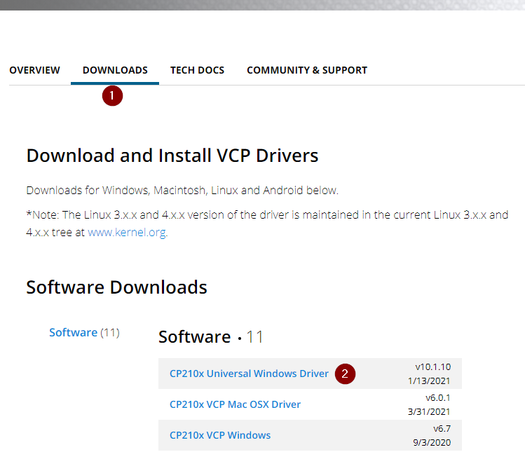
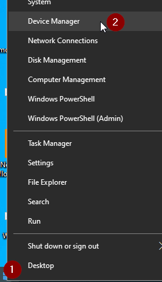
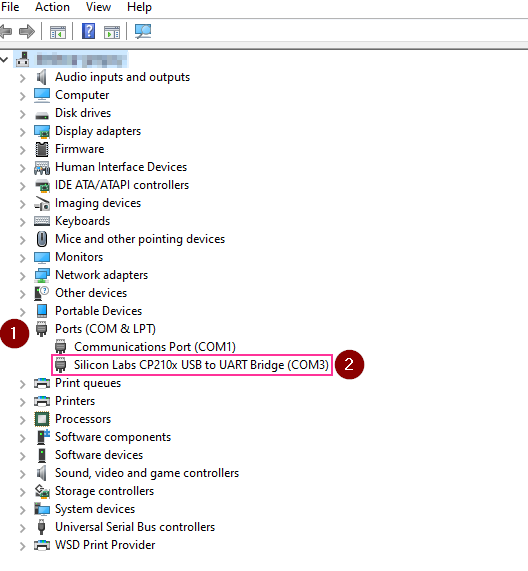
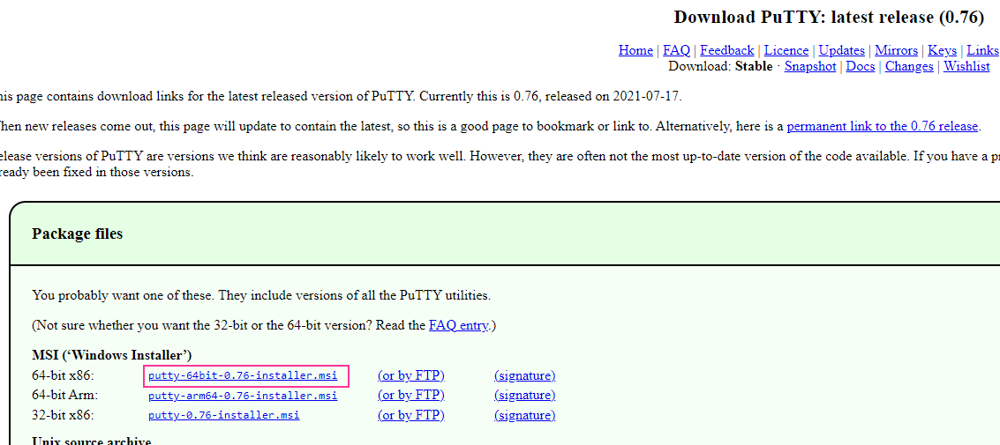
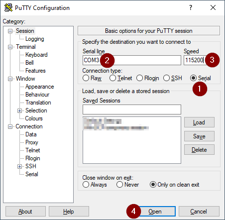
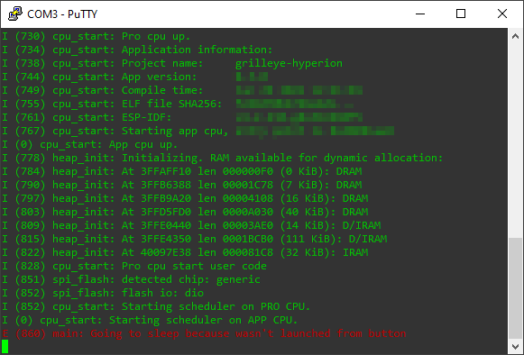
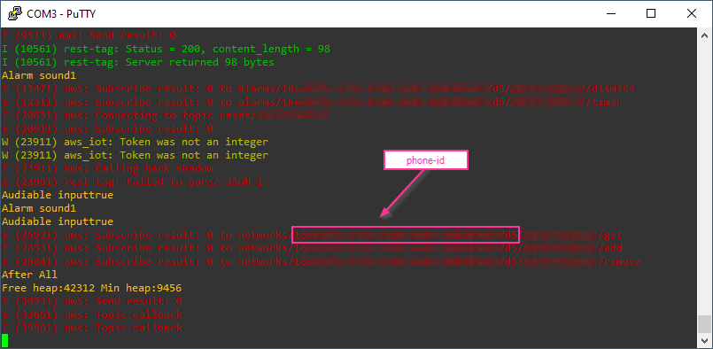

# GrillEye Max gui

**disclaimer**

This only works for GrillEye Max devices. You can find a store to buy one on the GrillEye website: https://grilleye.com/shops?selectedProduct=proplus_max

## Table of contents
- [GrillEye Max gui](#grilleye-max-gui)
  - [Table of contents](#table-of-contents)
  - [Why](#why)
  - [Before you start](#before-you-start)
  - [How to start](#how-to-start)
  - [Roadmap](#roadmap)
  - [Develop your own app using the api](#develop-your-own-app-using-the-api)
    - [Playing around](#playing-around)
  - [How to get your phone-id](#how-to-get-your-phone-id)
    - [Windows](#windows)
    - [Mac/Linux](#maclinux)

## Why
I recently bought a GrillEye Max and have been enjoying it a lot. However I don't like the fact that it doesn't have a web interface. Through the magic of computers and perseverence I have managed to reverse engineer the api. Later on my intention is to build a web interface using this.

## Before you start
Before you begin you'll need to acquire your phone-id. This is the key that is used to authenticate you against the api. Instructions on how to do this can be found in the "[How to get your phone-id](#how-to-get-your-phone-id)" section.

## How to start

- download or clone this repository
- navigate to the directory
- run the following command
```
docker-compose up -d
```
- **visit `<host`>:8000/settings to enter your phone-id**

You can also install this on your own webserver and make the src directory the entrypoint.

## Roadmap
- Start a new session from the dashboard and have an extra graph
- Pagination when using sessions
- Finish and polish mostly in the livegraph
- Map the endpoints for session management such as adding and removing probes
- Support for multiple grilleye's? 

## Develop your own app using the api
If you want to develop your own application you can use the openapi.yml or the postman.json file to browse and test the api. The postman.json contains a collection with variables where you can enter your phone-id and serial number.

If you want to browse the api in your browser you can go to the [openapi swagger ui demo and try it online](https://petstore.swagger.io/?url=https://raw.githubusercontent.com/epiecs/grilleye-max-gui/master/docs/openapi.yml)

### Playing around
If you want to test the api via the Swagger ui you will have to use the `CORS-PROXY server`. This is because the requests are blocked by [CORS](https://swagger.io/docs/open-source-tools/swagger-ui/usage/cors/). You wont have this issue when using Postman.

## How to get your phone-id
If you have a Linux device or Mac you don't need to download drivers, on Windows you need to install a specific one. 
For Linux, everything after kernel 4.x should recognize the device automatically. A recent Mac should also suffice.

### Windows
**These instructions are for Windows machines**. If you have a Linux device or Mac you don't need to download the drivers. Everything after kernel 4.x should recognize the device automatically.
1. Setup your GrillEye via the app and make sure that it can connect via the wifi.

2. Shutdown your GrillEye

3. Download the drivers at https://www.silabs.com/developers/usb-to-uart-bridge-vcp-drivers. You need the Universal Windows driver.



4. Shut down your GrillEye if you haven't yet and connect it to your computer via USB. **It is very important that your GrillEye is shut down!**

5. Right click your windows start button and choose device manager



6. In your device manager open the `Ports (COM & LPT)` section and look for a device with `CP210x` in it's name. Note down the **COM port**, you'll need it later.



7. Download Putty. This small and free application will allow us to access the device via a terminal. Putty can be downloaded at https://www.chiark.greenend.org.uk/~sgtatham/putty/latest.html. You need the 64 bit installer.



8. Start putty, Choose Serial and fill in the COM port that you found in your device manager and use `115200` as speed setting. After this click on open.



9. You should see a window like the one below. If you don't see any data yet don't worry. Sometimes the data is only shown later on.



10. Boot your GrillEye. You will see data scroll by in the Putty window.

11. After a while the text will stop scrolling. You should see some urls starting with `alarms` or `network`. In those urls you can find your phone-id value and the serial number of your GrillEye. You **only need your phone-id**.

Your phone-id is a long string (bit of text) that looks kinda like this `12abc3de-4567-89f0-a123-456b789012c3`. To copy this value just select it in the Putty window and it is copied automatically. Store it somewhere safe. **Seriously, anyone with this value has full access to your sessions, settings, data etc...**

I have blurred out my phone-id and serial number in the screenshot below but it looks kind of like this:



12. Shut down your GrillEye and close the Putty window.

### Mac/Linux
On a Mac or Linux system, you can do `screen /dev/tty.usbserial-1460 115200` and start at step 10 of the Windows process. 
