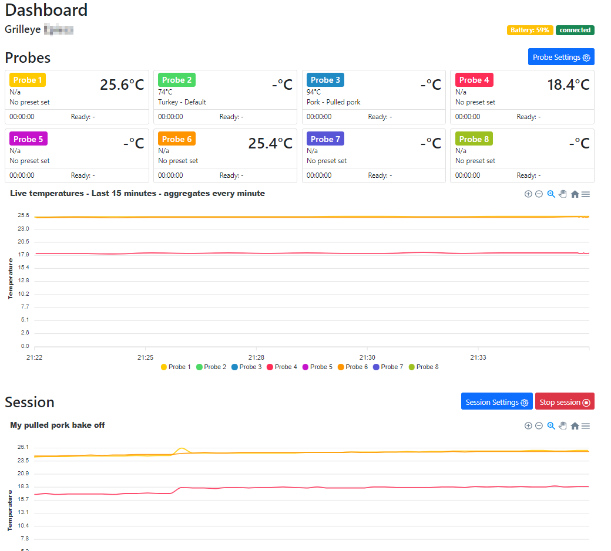
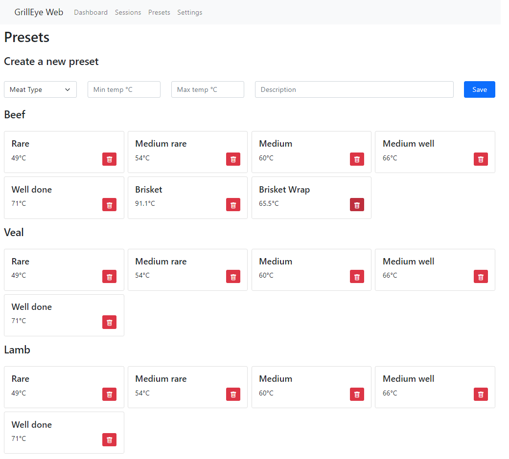
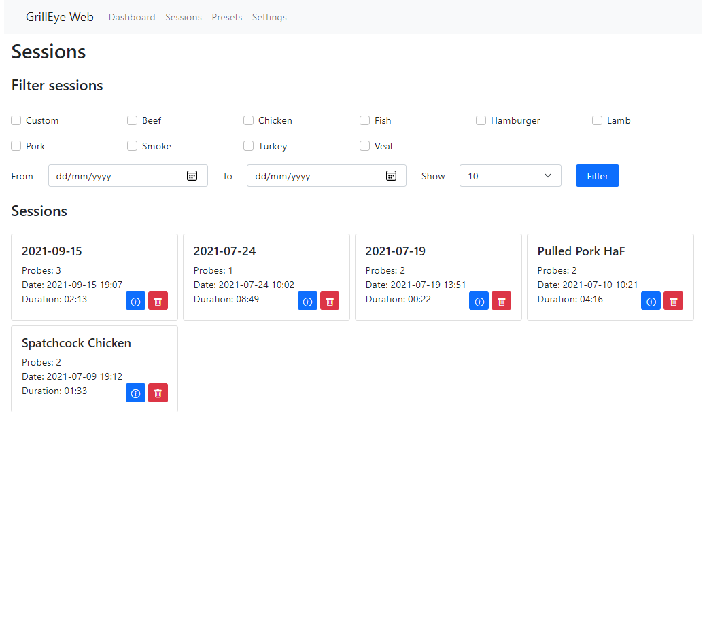
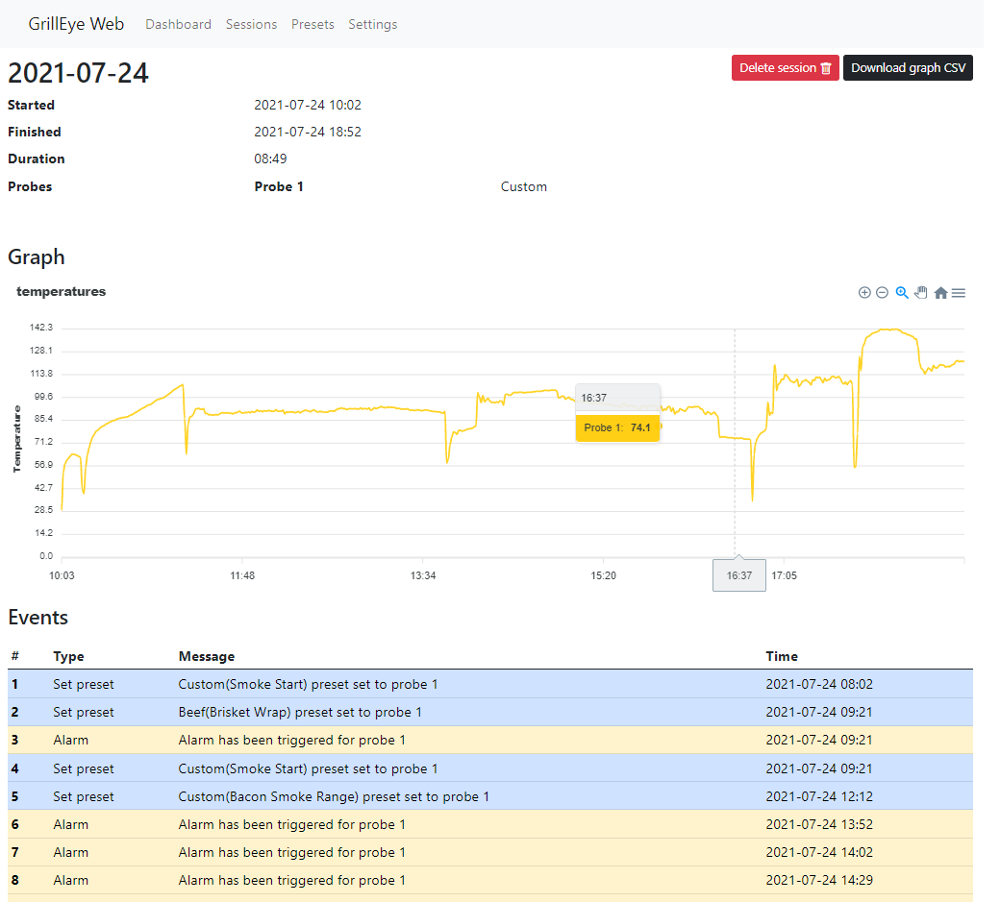

# GrillEye Max gui

**disclaimer**

This only works for GrillEye Max devices. You can find a store to buy one on the GrillEye website: https://grilleye.com/shops?selectedProduct=proplus_max

## Table of contents
- [GrillEye Max gui](#grilleye-max-gui)
  - [Table of contents](#table-of-contents)
  - [Why](#why)
  - [Before you start](#before-you-start)
  - [How to start](#how-to-start)
  - [Roadmap](#roadmap)
  - [Develop your own app using the api](#develop-your-own-app-using-the-api)
    - [Playing around](#playing-around)
  - [How to get your phone-id](#how-to-get-your-phone-id)
    - [Python script](#python-script)
    - [Manually with your own firmware dump](#manually-with-your-own-firmware-dump)
    - [Postman](#postman)
    - [Windows](#windows)
    - [Mac/Linux](#maclinux)
  - [Screenshots](#screenshots)
    - [Dashboard](#dashboard)
    - [Probe settings](#probe-settings)
    - [Presets](#presets)
    - [Preset](#preset)
    - [Sessions](#sessions)
    - [Session](#session)
    - [Local and GrillEye settings](#local-and-grilleye-settings)
  - [Disclaimer](#disclaimer)

## Why
I recently bought a GrillEye Max and have been enjoying it a lot. However I don't like the fact that it doesn't have a web interface. Through the magic of computers and perseverence I have managed to reverse engineer the api. I have used this to build a web interface.

The web interface should allow you to do all the things that you can do in the app. Some things are not yet implemented and can be found on the [roadmap](#roadmap).

## Before you start
Before you begin you'll need to acquire your phone-id. This is the key that is used to authenticate you against the api. Instructions on how to do this can be found in the "[How to get your phone-id](#how-to-get-your-phone-id)" section.

## How to start

- download or clone this repository
- navigate to the directory
- run the following command `docker compose up -d`
- **visit `<host`>:8000/settings to enter your phone-id**

You can also install this on your own webserver and make the src directory the entrypoint. Dont forget to run the composer install command.

**If you dont have composer installed yet you can follow the instructions at [getcomposer.org](https://getcomposer.org/download/)**

## Roadmap
- Support for multiple grilleye's? 
- Show max temp or range on chart (maybe too much with 8 probes?)

## Develop your own app using the api
If you want to develop your own application you can use the openapi.yml or the postman.json file to browse and test the api. The postman.json contains a collection with variables where you can enter your phone-id and serial number.

If you want to browse the api in your browser you can go to the [openapi swagger ui demo and try it online](https://petstore.swagger.io/?url=https://raw.githubusercontent.com/epiecs/grilleye-max-gui/master/docs/openapi.yml)

### Playing around
If you want to test the api via the Swagger ui you will have to use the `CORS-PROXY server`. This is because the requests are blocked by [CORS](https://swagger.io/docs/open-source-tools/swagger-ui/usage/cors/). You wont have this issue when using Postman.

## How to get your phone-id
> **There are a few methods described here that you can use to get your phone id. At the moment the only way that still works is by using postman or the python script. The method where you can extract the phone-id via a serial connection (putty) no longer works. It is just kept here in the documentation for posterity.**

### Python script

In the `scripts` folder you can find a Python script that automates this process. I have only tested this on a Mac so YMMV. This needs Python3 > `3.9`

> This script works by dumping the firmware of the grilleye and then looking for strings matching a specific regex. The script will automatically scan all serial ports to find the Grilleye.

For windows you will need to download the drivers at https://www.silabs.com/developers/usb-to-uart-bridge-vcp-drivers. You need the Universal Windows driver.

Connect your Grilleye to your pc. *You do not need to turn it on*. Your grilleye will turn on and off again automatically.

```sh
cd scripts
pip install -r requirements.txt

python3 get_phone_id.py
```

After the script has run you will be presented with a list of values. The last value is _usually_ your phone-id.

### Manually with your own firmware dump

> Linux/Mac/WSL is recommended for this step.

You can also do a manual firmware dump for your grilleye. I will not explain how to do this because this varies platform per platform. For this to work you will only need the first Megabyte of the firmware. Read up on how to dump the firmware for an esp32 using esptool :)

I assume that the dump is called `grilleye.bin` and that you have `strings` installed.

```
strings -n 10 grilleye.bin | grep -E '^[a-z0-9]{8}-[a-z0-9]{4}-[a-z0-9]{4}-[a-z0-9]{4}-[a-z0-9]{12}'
```

### Postman

Postman is a tool that is used to debug and test API's. You can get the installer from: [Postman download](https://www.postman.com/downloads/). The screenshots provided here and the explanation are for a windows installation. Most of the guide should remain exactly the same. There might be a small difference regarding the installation folder etc...

After you have installed Postman you will be greeted by the interface. Creation of an account is not neccesary for this to work.

Start with the following steps:

1. click in the lower portion on the interface on the link that says `Capture requests and cookies`

2. make sure that the url must contain `hyperion`. This is just so that you dont get overwhelmed with 1001 api requests that have nothing to do with the hyperion api

3. click on the button to enable the proxy


In the next screen you have to choose the port that will be used by your proxy. The standard port of `5555` is perfectly fine.


If you are asked by windows if you'd like to allow the connections through your firewall make sure to check all the boxes:


If everything is setup correctly you can now see that the proxy has been enabled:


We are almost there. Now you need to make sure that postman can intercept https traffic. In order to do this you need to **install a certificate** on your smartphone.

The certificate needs to be generated by the machine that is capturing the traffic. For this you need openssl. A guide on how to install this can be [found here](https://learning.postman.com/docs/sending-requests/capturing-request-data/capturing-https-traffic/#windows)

Now you need to install this certificate on your mobile phone. 

A guide on how to do this for different vendors such as iphone, android, etc.. [can be found in the official postman docs](https://learning.postman.com/docs/sending-requests/capturing-request-data/capturing-https-traffic/#ios). The easiest way I found is to email the certificate to yourself.

Fully close postman and start it again.

**Make sure to install this certificate**

After you have installed the certificate you need to tell your phone to use your computer as a proxy server. 

For an iphone you need to edit the settings of your wireless network. **don't forget to remove these settings later**. Per the postman docs you need to perform the following steps:

1. Select `Settings > Wi-Fi`.
2. Select Information icon next to a Wi-Fi connection. (the `i` with a circle around it)
3. Select `HTTP Proxy > Configure Proxy > Manual`.
4. Set Server to the `ip of your computer that is running postman` and Port `5555`.
5. Select `Save`.

A guide on how to do this for android can be [found here](https://www.howtogeek.com/295048/how-to-configure-a-proxy-server-on-android/)

Now go back to Postman and select the `start capture` button.

When you use the hyperion app you should now see the requests in the postman window. You can find your phone-id in there.


### Windows

**This no longer works**

If you have a Linux device or Mac you don't need to download drivers, on Windows you need to install a specific one. 
For Linux, everything after kernel 4.x should recognize the device automatically. A recent Mac should also suffice.

**These instructions are for Windows machines**. If you have a Linux device or Mac you don't need to download the drivers. Everything after kernel 4.x should recognize the device automatically.
1. Setup your GrillEye via the app and make sure that it can connect via the wifi.

2. Shutdown your GrillEye

3. Download the drivers at https://www.silabs.com/developers/usb-to-uart-bridge-vcp-drivers. You need the Universal Windows driver.


4. Shut down your GrillEye if you haven't yet and connect it to your computer via USB. **It is very important that your GrillEye is shut down!**

5. Right click your windows start button and choose device manager


6. In your device manager open the `Ports (COM & LPT)` section and look for a device with `CP210x` in it's name. Note down the **COM port**, you'll need it later.


7. Download Putty. This small and free application will allow us to access the device via a terminal. Putty can be downloaded at https://www.chiark.greenend.org.uk/~sgtatham/putty/latest.html. You need the 64 bit installer.


8. Start putty, Choose Serial and fill in the COM port that you found in your device manager and use `115200` as speed setting. After this click on open.


9. You should see a window like the one below. If you don't see any data yet don't worry. Sometimes the data is only shown later on.


10. Boot your GrillEye. You will see data scroll by in the Putty window.

11. After a while the text will stop scrolling. You should see some urls starting with `alarms` or `network`. In those urls you can find your phone-id value and the serial number of your GrillEye. You **only need your phone-id**.

Your phone-id is a long string (bit of text) that looks kinda like this `12abc3de-4567-89f0-a123-456b789012c3`. To copy this value just select it in the Putty window and it is copied automatically. Store it somewhere safe. **Seriously, anyone with this value has full access to your sessions, settings, data etc...**

I have blurred out my phone-id and serial number in the screenshot below but it looks kind of like this:


12. Shut down your GrillEye and close the Putty window.

### Mac/Linux

**This no longer works**

On a Mac or Linux system, you can do `screen /dev/tty.usbserial-1460 115200` and start at step 10 of the Windows process. 

## Screenshots

### Dashboard

### Probe settings

### Presets

### Preset

### Sessions

### Session

### Local and GrillEye settings


## Disclaimer
I tried to be as gentle with api calls towards the hyperion API as I possible could. Please use this respectfully and don't start being a dick towards the GrillEye folks.

And as always. This is free software. I take no responsibility whatsoever if things go wrong or you accidently delete something,...